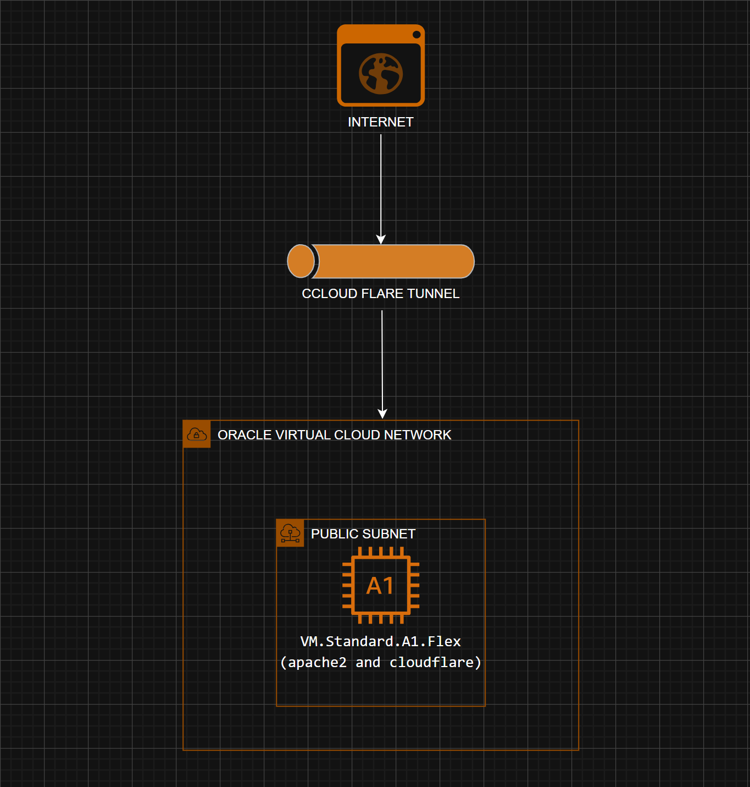
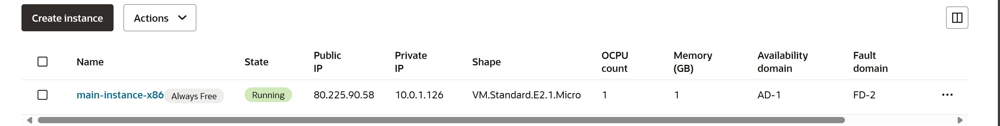
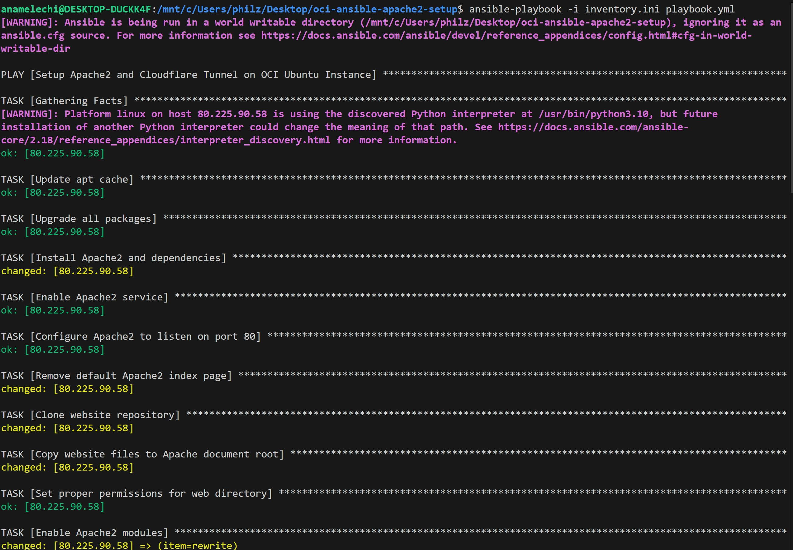
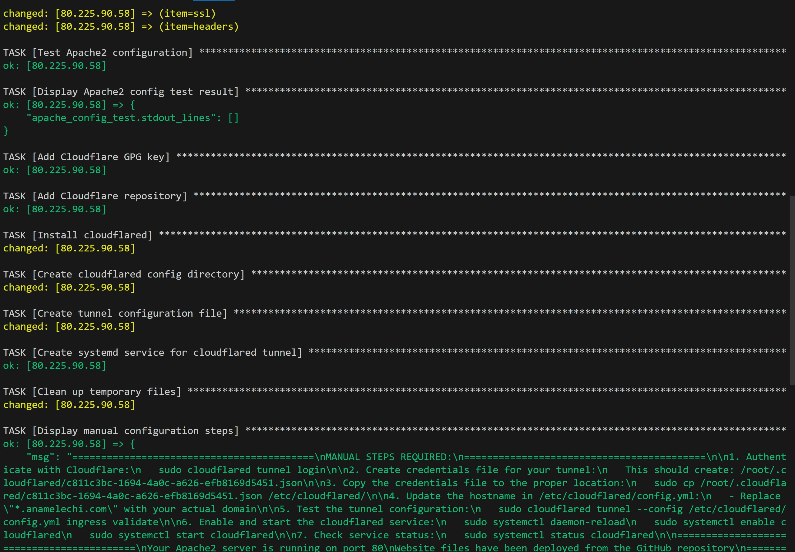
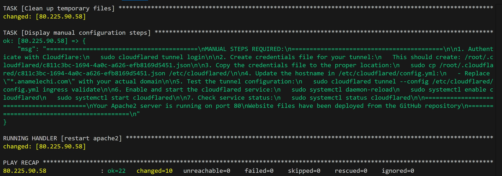

# ☁️ Oracle Cloud Infrastructure with Terraform & Ansible

[](https://terraform.io)
[](https://ansible.com)
[](https://cloud.oracle.com)
[](https://apache.org)
[](https://cloudflare.com)

## ✨ Overview

This project automates the deployment of a complete web hosting infrastructure on Oracle Cloud Infrastructure (OCI) using Infrastructure as Code principles. It provisions cloud resources with Terraform and configures applications with Ansible, creating a production-ready web server with secure tunnel access via Cloudflare.

### 🏛️ Architecture

The infrastructure includes:
- 🌐 **Virtual Cloud Network (VCN)** with public subnet and internet gateway  
- 💻 **ARM-based A1.Flex compute instances** with x86 fallback support  
- 💾 **Block storage volumes** for additional capacity  
- 🔒 **Security lists** with controlled ingress/egress rules  
- 🅰️ **Apache web server** deployment via Ansible  
- 🌩️ **Cloudflare Tunnel** for secure external access without port forwarding  





## 🔧 Prerequisites

### 📋 Required Tools
- 🛠️ Terraform >= 1.0  
- 🤖 Ansible >= 2.9  
- ☁️ Oracle Cloud CLI (optional but recommended)  
- 🔗 Git for repository management  

### 🔑 Required Accounts & Access
- 🏦 Oracle Cloud Infrastructure account with:  
  - 🆔 Tenancy OCID, User OCID, Fingerprint  
  - 🔒 API private key  
  - 👤 IAM permissions for Compute, Networking, and Storage  
- 🌐 Cloudflare account with:  
  - 🌍 Domain management access  
  - 🔐 Tunnel creation permissions  

### 🗝️ SSH Key Pair
Generate an SSH key pair for instance access:  
```bash
ssh-keygen -t rsa -b 4096 -f ~/.ssh/oci-key
```


## 🗂️ Project Structure

```
├── oracle-terraform-script/
│   ├── main.tf                    # 🌍 Main Terraform configuration
│   ├── variables.tf               # 🔢 Variable definitions
│   ├── outputs.tf                 # 🎯 Output definitions
│   ├── terraform.tfvars           # 📝 Variable values (create from template)
│   ├── terraform.tfvars.template  # 📄 Template for variables
│   └── oci_retry_script.sh        # 🔄 Multi-region retry script
├── ansible-apache2-cloudflare-setup/
│   ├── playbook.yml               # 📜 Main Ansible playbook
│   ├── inventory.ini              # 📋 Inventory template
│   └── group_vars/
│       └── all.yml                # 🌐 Group variables
├── website/                       # 🏠 Website files
│   ├── index.html
│   ├── styles.css
│   ├── main.js
│   └── assets/
└── README.md
```


## 🧱 Terraform Configuration

### 🔧 Required Variables

Create `terraform.tfvars` from the template and populate with your values:

| Variable              | Description                           | Example                            |
|-----------------------|---------------------------------------|------------------------------------|
| `tenancy_ocid`        | OCI Tenancy OCID                      | `ocid1.tenancy.oc1..aaaa...`       |
| `user_ocid`           | OCI User OCID                         | `ocid1.user.oc1..aaaa...`          |
| `fingerprint`         | API key fingerprint                   | `aa:bb:cc:dd:ee:ff...`             |
| `private_key_path`    | Path to OCI API private key           | `~/.oci/oci_api_key.pem`           |
| `compartment_ocid`    | Target compartment OCID               | `ocid1.compartment.oc1..aaaa...`   |
| `region`              | OCI region                            | `eu-milan-1`                       |
| `ssh_public_key_path` | SSH public key path                   | `~/.ssh/oci-key.pub`               |
| `preferred_ad`        | Preferred Availability Domain (0,1,2) | `0`                                |
| `use_x86_fallback`    | Use x86 if ARM unavailable            | `false`                            |

### 🗝️ Key Resources

#### 🌐 Networking Components
- **VCN**: 10.0.0.0/16 CIDR block with DNS resolution  
- **Public Subnet**: 10.0.1.0/24 with route to Internet Gateway  
- **Security List**: SSH (22), HTTP (80), HTTPS (443), Cloudflared (7844)  
- **Internet Gateway**: Provides internet access  

#### 💻 Compute Resources
- **Primary**: ARM-based VM.Standard.A1.Flex (2 OCPUs, 12 GB RAM) – Free-tier eligible  
- **Fallback**: x86 VM.Standard.E2.1.Micro – Always free-tier eligible  
- **Block Volume**: 100 GB additional storage, paravirtualized attachment  

### ⚙️ Terraform Usage

1. 🚀 **Initialize Terraform**  
   ```bash
   cd oracle-terraform-script/
   terraform init
   ```

2. 📝 **Create variable file**  
   ```bash
   cp terraform.tfvars.template terraform.tfvars
   # Edit terraform.tfvars with your values
   ```

3. 🔍 **Plan deployment**  
   ```bash
   terraform plan --out tfplan
   ```

4. ✅ **Apply configuration**  
   ```bash
   terraform apply "tfplan"
   ```

5. 🔄 **For ARM instance capacity issues, use retry script**  
   ```bash
   chmod +x oci_retry_script.sh
   ./oci_retry_script.sh
   ```


### 📤 Terraform Outputs

| Output                  | Description                                 |
|-------------------------|---------------------------------------------|
| `instance_public_ip`    | Public IP address of the created instance   |
| `instance_private_ip`   | Private IP address within the VCN           |
| `vcn_id`                | Virtual Cloud Network identifier            |
| `subnet_id`             | Public subnet identifier                    |



## 🤖 Ansible Configuration

### 📝 Inventory Setup

1. 🔄 **Update inventory after Terraform deployment**  
   ```bash
   cd ansible-apache2-cloudflare-setup/
   # Get the public IP from Terraform output
   terraform -chdir=../oracle-terraform-script output instance_public_ip
   ```

2. ✏️ **Edit `inventory.ini`**  
   ```ini
   [oci_server]
   YOUR_PUBLIC_IP ansible_user=ubuntu \
     ansible_ssh_private_key_file=~/.ssh/oci-key \
     ansible_ssh_common_args='-o StrictHostKeyChecking=no'
   ```


### ▶️ Playbook Execution

```bash
ansible-playbook -i inventory.ini playbook.yml
```

The playbook performs:
- 🔄 System package updates
- 🅰️ Apache2 installation and configuration
- 🌐 Website deployment from GitHub repository
- ☁️ Cloudflared installation and initial setup
- 🔧 Systemd service configuration

> **Note:** Update these variables in `playbook.yml` before running:  
> - `website_repo`: Your GitHub repository URL  
> - `tunnel_name`: Desired tunnel name  
> - `tunnel_id`: Cloudflare tunnel ID (obtain after tunnel creation)





## 🌩️ Cloudflare Tunnel Setup

### 🔑 Initial Configuration

1. 🔐 **Authenticate with Cloudflare**  
   ```bash
   sudo cloudflared tunnel login
   ```

2. 🆕 **Create a new tunnel** (or use existing)  
   ```bash
   sudo cloudflared tunnel create oci-tunnel
   ```

3. 📄 **Copy tunnel credentials**  
   ```bash
   sudo cp /root/.cloudflared/TUNNEL_ID.json /etc/cloudflared/
   ```

4. 🛠️ **Update `config.yml`**  
   ```yaml
   tunnel: YOUR_TUNNEL_ID
   credentials-file: /etc/cloudflared/YOUR_TUNNEL_ID.json

   ingress:
     - hostname: "your-domain.com"
       service: http://localhost:80
     - hostname: "*.your-domain.com"
       service: http://localhost:80
     - service: http_status:404
   ```

5. 🌐 **Configure DNS in Cloudflare Dashboard**  
   - Add CNAME record: `your-domain.com` → `YOUR_TUNNEL_ID.cfargotunnel.com`  
   - Enable proxy (orange cloud)

6. ▶️ **Start and enable service**  
   ```bash
   sudo systemctl daemon-reload
   sudo systemctl enable cloudflared
   sudo systemctl start cloudflared
   sudo systemctl status cloudflared
   ```


## 🔒 Environment Variables & Security

### 📋 Environment File Template

Create `.env` file for sensitive variables:
```bash
# OCI Configuration
export TF_VAR_tenancy_ocid="ocid1.tenancy.oc1..aaaa..."
export TF_VAR_user_ocid="ocid1.user.oc1..aaaa..."
export TF_VAR_fingerprint="aa:bb:cc:dd..."
export TF_VAR_private_key_path="~/.oci/oci_api_key.pem"
export TF_VAR_compartment_ocid="ocid1.compartment.oc1..aaaa..."

# Load with:
source .env
```


### 🚫 .gitignore Configuration

```gitignore
# Terraform
*.tfstate
*.tfstate.*
*.tfvars
.terraform/
.terraform.lock.hcl

# SSH Keys
*.pem
*_rsa
*_rsa.pub
id_*

# Environment files
.env
*.env

# Ansible
inventory.ini
host_vars/
group_vars/*/vault.yml

# Cloudflare
credentials.json
*.json
```


## 💡 Best Practices & Tips

### 🔄 From Previous Oracle + Terraform Projects

#### 🔖 Resource Naming Convention
- Use consistent prefixes: `main-`, `prod-`, `dev-`  
- Include environment in names: `main-vcn-prod`  
- Keep names descriptive but concise

#### 🗄️ State Management
```hcl
# Consider adding remote state backend
terraform {
  backend "s3" {
    # Configure for OCI Object Storage or AWS S3
  }
}
```

#### 🏷️ Resource Tagging
```hcl
freeform_tags = {
  Environment = "production"
  Project     = "web-hosting"
  CreatedBy   = "terraform"
  Owner       = "your-name"
}
```

#### 🔐 Security Best Practices
- Use specific CIDR blocks instead of `0.0.0.0/0` when possible  
- Implement least-privilege IAM policies  
- Enable OCI Cloud Guard and Security Zones  
- Rotate API keys regularly

#### ⚡ Performance Optimization
- Choose ARM instances for cost efficiency  
- Implement proper lifecycle rules  
- Monitor with OCI native tools  
- Automate block volume backups


## 🛠️ Troubleshooting

### ❗ Common Issues

#### 🚧 ARM Instance Capacity
**Problem:** ARM instances unavailable in selected region/AD  
**Solution:**  
- Use the retry script to try multiple regions  
- Set `use_x86_fallback = true` in `terraform.tfvars`  
- Try different availability domains

#### 🔑 SSH Connection Issues
**Problem:** Cannot connect to instance  
**Solutions:**  
```bash
# Verify security list rules
terraform show | grep -A 20 "security_list"

# Check SSH key path and permissions
chmod 600 ~/.ssh/oci-key

# Test connection with verbose output
ssh -v -i ~/.ssh/oci-key ubuntu@PUBLIC_IP
```

#### 🌐 Cloudflare Tunnel Issues
**Problem:** Tunnel not connecting  
**Solutions:**  
```bash
# Check tunnel status
sudo cloudflared tunnel info TUNNEL_NAME

# Verify configuration
sudo cloudflared tunnel --config /etc/cloudflared/config.yml ingress validate

# Check service logs
sudo journalctl -u cloudflared -f
```
```markdown
#### 🛡️ Apache Service Issues  
**Problem**: Website not accessible  
**Solutions**:  
```bash
# Check Apache status
sudo systemctl status apache2

# Verify port binding
sudo netstat -tlnp | grep :80

# Check Apache logs
sudo tail -f /var/log/apache2/error.log
```

#### 📊 Resource Limits  
Monitor OCI service limits:  
- 🖥️ Compute instances per availability domain  
- 📦 Block volume storage quota  
- 🌐 VCN limits per tenancy  

#### 🌐 Network Connectivity  
Debug network issues:  
```bash
# Test internal connectivity
curl localhost:80

# Test external connectivity (from instance)
curl -I http://httpbin.org/ip

# Verify DNS resolution
nslookup your-domain.com
```

#### 🔄 Maintenance & Updates  

**Regular Tasks**  
- 🔄 Update Terraform providers: `terraform init -upgrade`  
- 📦 Update Ansible collections: `ansible-galaxy collection install --upgrade oracle.oci`  
- 💰 Monitor OCI costs and usage  
- 🔐 Review security list rules quarterly  
- 📝 Update website content in GitHub repository  

**Backup Strategy**  
- 🛡️ OCI automatic backups for boot volumes  
- 🗄️ Custom block volume snapshots  
- 🗂️ Export Terraform state regularly  
- 📝 Document configuration changes  

#### 🤝 Contributing  
1. 🍴 Fork the repository  
2. 🌿 Create a feature branch: `git checkout -b feature-name`  
3. 🛠️ Make changes and test thoroughly  
4. 🔃 Submit a pull request with a detailed description  

#### 🧑‍💻 Development Guidelines  
- 📛 Follow Terraform naming conventions  
- 📝 Add appropriate variable descriptions  
- 🏷️ Include tags on all resources  
- 🧪 Test playbooks on clean instances  
- 🔍 Document any manual steps required  

#### 📜 License  
This project is licensed under the MIT License – see the [LICENSE](LICENSE) file for details.  

#### 🧑‍🎓 Author & Contact  
**Anamelechi Philip Njoku**  
- **Role**: Cloud DevOps Engineer  
- **Email**: [philznjoku@gmail.com](mailto:philznjoku@gmail.com)  
- **LinkedIn**: [anamelechi-philip-njoku](https://linkedin.com/in/anamelechi-philip-njoku)  
- **GitHub**: [@Anamelechi](https://github.com/Anamelechi)  
- **Location**: Rome, Italy  

#### 🙏 Acknowledgments  
- ☁️ Oracle Cloud Infrastructure Free Tier program  
- 🌩️ Cloudflare Tunnel service  
- ⚙️ Terraform OCI Provider contributors  
- 🤝 Ansible community modules  
